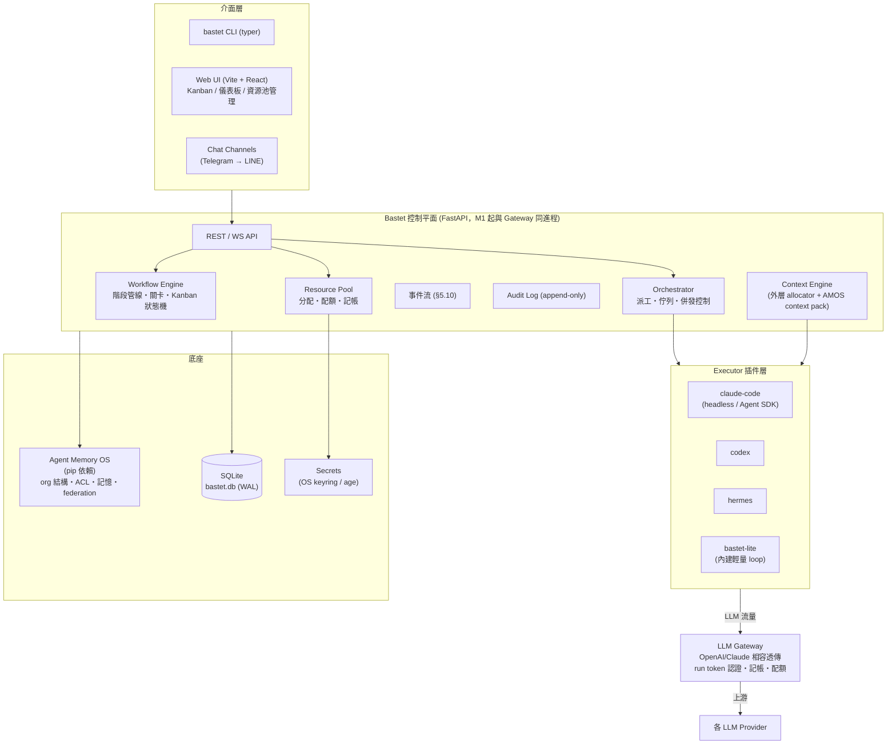

# Bastet Agent OS — 設計規格（SPEC）

> 版本：v1.1（M0 定稿 + 三方審查修訂）
> 日期：2026-07-28
> 狀態：審查通過，M1 實作中
> 審查紀錄：v1.0 經三個獨立視角審查（架構一致性、資料模型/工程可行性、安全設計），
> 共 13 high / 19 medium / 8 low 發現，全數 high 與關鍵 medium 已落入本版條文（D12）。

---

## 1. 願景與定位

**Bastet Agent OS 是 local-first 的「AI agent 團隊作業系統／控制平面」**：
把一群既有的 agent（Claude Code、Codex CLI、Hermes、任何 OpenAI/Claude 相容
端點）組織成有角色、有流程、有資源治理的執行團隊，讓多個專案可控地併發推進。

一句話差異化：

> Local-first、你自己跑的 agent 團隊作業系統 ——
> 記憶（AMOS）、組織、資源、流程四合一，開源、跨三平台。

Bastet **不是**另一個 agent 框架。市面上 CrewAI / AutoGen / LangGraph / Dify
解決的是「怎麼寫一個 agent」；Bastet 解決的是「誰、用什麼資源、照什麼流程、
做哪個專案」。執行力來自編排既有 agent，護城河來自：

1. **AMOS 記憶底座** — teams/projects ACL、federation、動態 context pack（已出貨）。
2. **資源治理** — 集中控管 LLM/MCP/多媒體資源的分配、配額、記帳、路由。
3. **可稽核的工作流** — 有 review 關卡的管線 + Kanban + append-only audit。

### 1.1 非目標（Non-goals）

- ❌ 重造一個通用 agent loop 與 Claude Code 競爭（內建 loop 僅限輕量任務，見 §5.1.5）。
- ❌ 視覺化自由 DAG 流程編輯器（工作流採「階段管線」模型，見 §5.4）。
- ❌ 託管雲服務／SaaS（local-first；federation 走 AMOS 既有機制）。
- ❌ WeChat channel（官方 API 限制，列遠期/社群貢獻）。
- ❌ 對外客服型 chatbot（channel 定位是「人對 Bastet 下指令與收通知」，見 §5.7）。

### 1.2 支援平台

Linux、macOS、Windows。授權：Apache-2.0（與 AMOS 一致）。
品牌視覺與 AMOS 貓 logo 同系列（D11）。

---

## 2. 架構總覽



### 2.1 核心設計原則

1. **Executor 是介面，決策可逆** — 內建 loop 只是插件之一，任何時候可以調整
   「整合 vs 自建」的比重，使用者無感。
2. **治理不可繞過（在其安全邊界內）** — executor 的 LLM 流量預設經過 Gateway；
   無法過站者（訂閱制直連，如 Claude Max）退而用 usage 回報記帳，並在 UI 標示
   精度等級。**誠實聲明**：worktree 模式下 agent 與 Bastet 同 OS user 執行，
   治理與 audit 對「惡意或被注入的 agent」不構成安全邊界（詳見 §5.9 威脅模型）；
   對抗性情境須用 container 隔離或獨立 OS user 部署。
3. **AMOS 是唯一事實來源（org）** — teams/projects/members 不重複實作，
   Bastet 只加自己的擴充表（Role、Job、資源授權）引用 AMOS id。
4. **一切狀態轉移可稽核** — 派工、關卡通過、資源配額變更、機敏資料 resolve，
   全部寫入 append-only audit log。**自 M1 起生效**（最小路徑：派工、grant
   變更、gateway 請求摘要、secret resolve）。
5. **Local-first** — 單機零依賴可用；多機透過 AMOS federation 機制（M5）。

---

## 3. 核心概念與資料模型

| 概念 | 說明 | 來源 |
|---|---|---|
| **Team / Project / Member** | 組織結構與成員 | **AMOS**（引用，不複製） |
| **Project（擴充）** | AMOS project 的 Bastet 側擴充：repo 路徑、預設 template、專案 config | Bastet |
| **Agent** | 一個可派工的執行者：綁定 executor 類型、AMOS agent id | Bastet |
| **Role** | 專案內職能：`engineer` / `reviewer` / `security-reviewer` / `pm` / `tester`…以 `project_agent_roles` 指派，是派工匹配的依據 | Bastet |
| **Resource** | 一項可治理的資源：`llm` / `mcp` / `image` / `video` / `music` / `tts` / `stt` / `skill` / `secret`，含連線方式、憑證引用、路由設定 | Bastet |
| **Grant** | 資源授權：哪個 team/project/agent 可用哪個 resource、預算週期與並發上限 | Bastet |
| **Workflow Template** | 階段管線定義：階段序列 + 每階段的關卡（gate）與執行 role | Bastet |
| **Job（卡片）** | 一個任務：屬於 project、走某 template（建立時 snapshot stages）、當前階段即 Kanban 欄位 | Bastet |
| **Run** | Job 在某階段的一次執行嘗試：executor、隔離方式、用量、產出、終態 | Bastet |
| **Gate** | 階段出口條件與 verdict 協議（§5.4.2） | Bastet |
| **Run Token** | 短效不透明 token，run 對 gateway 的唯一憑證（§5.2.1） | Bastet |
| **Channel** | 通知/指令通道：Telegram bot 等 | Bastet |
| **Secret** | 機敏資料引用（DB 只存 reference，實體在 keyring/加密檔） | Bastet |

### 3.1 SQLite 表定義（M1 定稿）

所有引用 AMOS 的 id 欄位皆為 TEXT（AMOS id 型別）。

```
projects(id TEXT PK,              -- = AMOS project id（一對一，D7）
         team_id TEXT,            -- = AMOS team id（AMOS 不變量：project 必屬一 team）
         repo_path, default_template_id, config_json,
         created_at, updated_at)

agents(id PK, amos_agent_id TEXT, name, executor_type,
       enabled, config_json, created_at, updated_at)

project_agent_roles(project_id, agent_id, role, preference, PRIMARY KEY(project_id, agent_id, role))

resources(id PK, kind, name, endpoint, api_flavor{openai|anthropic},
          secret_ref, routing_json,   -- routing_json: 模型別名、failover 目標、degrade 目標
          enabled, config_json, created_at, updated_at)

grants(id PK, resource_id, scope_type{team|project|agent}, scope_id TEXT,
       budget_tokens, budget_usd, period{lifetime|daily|monthly},
       max_concurrency, priority, on_exceed{block|queue|degrade},  -- 預設 block
       enabled, expires_at, created_at)

workflow_templates(id PK, name, version, stages_json)

jobs(id PK, project_id TEXT, template_id, stages_snapshot_json,  -- 建立時 snapshot，防 template 改版漂移
     title, spec_md, stage, status{open|in_progress|blocked|done|cancelled},
     priority, parent_job_id,       -- parent = 任務分解關係
     worktree_path,                 -- worktree 屬於 job（§5.4.3），run 在其中執行
     version,                       -- optimistic lock；狀態轉移一律 CAS：UPDATE ... WHERE version=?
     created_at, updated_at)

job_deps(job_id, depends_on_job_id, effect{block|context}, PRIMARY KEY(job_id, depends_on_job_id))

runs(id PK, job_id, stage, attempt, agent_id,
     executor_type,                 -- 刻意 denormalize：run 時點 snapshot，勿「修正」成 join
     workdir, isolation{worktree|container},
     status{queued|running|waiting_input|succeeded|failed|cancelled|timeout|orphaned},
     error, executor_handle_json,   -- 持久化 handle state，控制平面重啟後重建 RunHandle（§5.1.3）
     tokens_in, tokens_out, cache_read, cache_write, cost_usd,  -- 由 usage_ledger 聚合
     accounting_precision{gateway|reported|estimated},
     version, started_at, finished_at, artifacts_json)

run_tokens(id PK, run_id, token_hash,   -- 只存 hash，明文僅發放當下存在於記憶體
           expires_at, revoked_at)

usage_ledger(id PK, run_id, resource_id, model, provider_request_id,
             tokens_in, tokens_out, cache_read, cache_write,   -- cache 計價異於一般 input（§5.2.3）
             cost_usd, at)

gate_results(id PK, run_id, gate_type, verdict,
             reviewer_kind{agent|user}, reviewer_id, detail_md, at)

audit_log(id PK, at, actor, action, target_type, target_id,
          detail_json,              -- 明定禁含 secret 明文與 auth header
          prev_hash, row_hash)      -- hash chain：竄改可偵測（防誤操作與事後追溯，非防本機惡意者，§5.9）

channels(id PK, kind, config_json, secret_ref, enabled)
```

### 3.2 SQLite 併發策略（M1 載明）

- `PRAGMA journal_mode=WAL; busy_timeout>=5000; synchronous=NORMAL; foreign_keys=ON`
  （FK 預設關閉，必須顯式開）。
- 寫入採短交易；控制平面與 gateway **同一 FastAPI 進程**（M1 決策），共用單一
  writer 連線（序列化寫入），讀取用獨立唯讀連線。
- 配額 check-and-reserve 用 `BEGIN IMMEDIATE` 短交易（§5.2.4）。
- `jobs`/`runs` 狀態轉移一律 CAS（`UPDATE ... WHERE id=? AND version=?`）。

---

## 4. 技術棧

| 層 | 選型 | 理由 |
|---|---|---|
| 後端 | Python 3.11+ / FastAPI / SQLite | 與 AMOS 同構，直接 `import agent_memory_os`；三平台無痛 |
| CLI | typer | `bastet` 指令族；thin client 打控制平面 REST API |
| 前端 | Vite + React（TypeScript），M1 先用伺服端最小狀態頁 | Kanban/儀表板互動重（M2 起） |
| Gateway | 自寫最小透傳層（D8），與控制平面同進程 | 上游已限 OpenAI/Claude 相容，需求是治理不是格式翻譯；backend 可換介面；價格表引用 LiteLLM 公開 model_prices JSON |
| Web UI 認證 | M1 單使用者 token（D9）：CSPRNG、檔案 0600、走 `Authorization` header（非 cookie，免 CSRF）；服務預設僅 bind 127.0.0.1，驗證 Host/Origin 防 DNS rebinding；CORS 不設 wildcard；WS 握手同樣驗 token 與 Origin | 多使用者與個別權限排 M3+ |
| 打包 | pip `bastet-agent-os[full]` + Docker | 沿用 AMOS 發布紀律 |
| 倉庫 | 獨立 repo，pip 依賴 `agent-memory-os` | AMOS 保持單一職責，兩邊獨立發版 |

---

## 5. 子系統設計

### 5.1 Executor 插件層

#### 5.1.1 介面（v1.1）

```python
class Executor(Protocol):
    """一種 agent 執行後端。實作以 entry point 註冊：bastet.executors"""

    kind: str                      # "claude-code" | "codex" | "hermes" | "bastet-lite"
    capabilities: set[str]        # {"code", "review", "light-task", "mcp", ...}

    async def start(self, task: TaskSpec) -> RunHandle: ...
    #   TaskSpec: prompt、workdir、context pack、gateway 端點 + run token、
    #             逾時、允許的工具面、read_only（reviewer run 強制唯讀，§5.4.2）、
    #             unattended_policy（無人值守時對 interaction_request 的預設：deny|timeout）

    async def stream(self, h: RunHandle) -> AsyncIterator[RunEvent]: ...
    #   RunEvent: progress | tool_call_summary | usage | artifact
    #           | interaction_request(request_id, kind, payload)   # 權限請求/計畫批准/澄清

    async def respond(self, h: RunHandle, request_id: str, reply: InteractionReply) -> None: ...
    #   回覆 interaction_request；channel/UI 的「run 中批准」走此通道

    async def cancel(self, h: RunHandle) -> None: ...
    async def result(self, h: RunHandle) -> RunResult: ...
    #   RunResult: 結束狀態、產出摘要、diff/artifact 路徑、用量與記帳精度、
    #             structured_verdict（gate 用的結構化欄位，與自由文字嚴格分離，§5.4.2）
```

**RunHandle 持久化契約**：handle state 必須可序列化（存 `runs.executor_handle_json`），
控制平面重啟後以 `kind + handle state` 重建並重新 attach；無法重接的 run 標
`orphaned` 終態。

#### 5.1.2 claude-code executor（M1 首發）

- Headless：`claude -p --output-format stream-json`；usage 與 `total_cost_usd`
  取自 result 事件（`reported` 精度）。
- **兩種記帳路徑，部署形態不同，M1 兩者皆為驗收對象**：
  1. Gateway 路徑：`ANTHROPIC_BASE_URL` 指向 Bastet gateway +
     `ANTHROPIC_AUTH_TOKEN`=run token → `gateway` 精度、API 計價。
     **與 Max 訂閱互斥**。
  2. 訂閱直連路徑：不設 base URL，走使用者訂閱 → `reported` 精度。
- 工具面：TaskSpec 的允許工具映射到 `--allowedTools` / permission mode；
  headless 預設會卡權限提示，M1 必須顯式傳遞。
- 取消/逾時：SIGTERM → 寬限期 → SIGKILL；已收到的部分 usage 記帳並標
  `estimated`，run 終態 `cancelled`/`timeout`。

#### 5.1.3 run 存活性與重試

- Run 狀態機見 §3.1 enum；執行失敗（非業務失敗）依 stage 的 `max_retries`
  （定義於 template stage）自動重試，`attempt` 遞增。
- Gate 不過的回退（§5.4）是業務失敗，不計入 `max_retries`。
- Run token TTL ≥ run 逾時上限，不做續期（M1 簡化；逾時上限即 token 上限）。

#### 5.1.4 記帳精度等級

每個 run 標記 `accounting_precision`：

- `gateway` — 流量過 Bastet Gateway，逐請求精確（含 cache token）。
- `reported` — executor 自行回報（如 Claude Code 的 result usage）。
- `estimated` — 中斷/異常下的部分估算。UI 明示，避免假精確。

#### 5.1.5 `bastet-lite`（內建輕量 loop，M3）

**能力範圍刻意受限**：摘要、分類、單檔修改、review 意見彙整、資料轉換。
不做多步規劃、不做大型 coding。最小工具集（D10）：

1. `read_file` / `write_file`（限 workdir 內）
2. 白名單 shell（預設唯讀指令集，逐專案可擴充）
3. AMOS 記憶操作（search / add / context pack）

存在意義：動態 Context 引擎的完全體試驗場（每輪 payload 100% 由 Bastet 組裝）；
零外部 CLI 依賴的保底執行力。

### 5.2 LLM Gateway

- OpenAI 相容（`/v1/chat/completions`）+ Anthropic 相容（`/v1/messages`）入口。
- **監聽面**：預設 127.0.0.1；container run 需經 Docker bridge /
  `host-gateway` alias 連回，**不得**為此綁 0.0.0.0（顯式旗標 + 警告才可）。
  所有端點（健康檢查除外）必須驗 run token，無匿名可用面。
- 憑證只存在 gateway 側，executor 拿不到真實上游 key。

#### 5.2.1 Run token 規格

- ≥128-bit CSPRNG 不透明 token（非 JWT：本地查表即可、可即時撤銷）。
- DB 只存 hash（`run_tokens.token_hash`）；明文僅在發放當下經 TaskSpec 傳給 executor。
- TTL = run 逾時上限；run 進入**任何終態**（成功/失敗/取消/逾時）即主動撤銷。
- **洩漏爆炸半徑（驗收條款）**：持有 token 僅能以該 run 的 grant 花費預算至
  硬停為止；拿不到上游 key；碰不到其他 project 的資源。

#### 5.2.2 SSE 透傳與 usage 抽取

- OpenAI 串流預設不含 usage：gateway 對 OpenAI 入口**改寫 request body**注入
  `stream_options: {"include_usage": true}`，並在回應中透傳（client 多收一個
  usage chunk 無害）。
- Anthropic 串流天然攜帶：`message_start`（input/cache tokens）+
  `message_delta`（累計 output tokens）。
- Client 中途斷線：gateway 取消上游請求，以已收到的部分 usage 記帳並標
  `estimated`。

#### 5.2.3 計價

- `usage_ledger` 逐請求記錄，區分 `tokens_in / tokens_out / cache_read /
  cache_write`（cache 計價異於一般 input；Claude Code 大量使用 prompt cache，
  不分列會算錯錢）。
- 價格表引用 LiteLLM 公開維護的 `model_prices_and_context_window.json`
  （定期更新的本地快取；吃資料不吃依賴）。
- `runs` 上的彙總欄位由 ledger 聚合，供快速查詢。

#### 5.2.4 配額執行（兩段式）

1. **派工前檢查**（所有精度適用）：並發上限 + 剩餘預算預估，不過即依
   `on_exceed` 處理（預設 `block`；`queue` 進 FIFO；`degrade` 換
   `routing_json` 指定的降級模型）。
2. **流中硬停**（僅 `gateway` 精度）：admission 採 check-and-reserve
   （`BEGIN IMMEDIATE` 短交易，以「已記帳 + 進行中預留」判斷），請求完成後
   沖銷預留。串流 usage 只在結尾可知，**明文接受最後一筆請求的有界
   overshoot** —— 宣稱零超支才是假精確。
3. `reported` 精度的 run 超出預算：完成後標記超額，**暫停該 grant 的後續
   派工**直到人工處理或週期重置。

### 5.3 資源池與治理

- 資源 CRUD + 健康檢查（endpoint 可達性、key 有效性；失敗訊息一律遮罩 secret）。
- Grant 三層 scope：team / project / agent，衝突時取最嚴格；預算有
  `period`（lifetime/daily/monthly），燃燒率與重置語意以此定義。
- `kind` 含 `secret`：獨立機敏資料（如部署 token）也是 resource，走同一
  grant 機制（不另設 secret_grants）。
- 儀表板：用量 by project/agent/resource、預算燃燒率。
- 多媒體資源（image/video/music/tts/stt）M1 只定義資源類型與記帳欄位，
  executor 工具整合排 M4。

**分類與 run-time 可用性（v0.6）**

- `resource_kinds.py` 是單一分類表：`llm / mcp / api / skill / git` 加多媒體，
  分成 model / tool / asset / media 四組。每個 kind 宣告 `fields`（WebUI 要顯示
  哪些欄位）與 `auth`（required / optional / none — SKILL 就是 none），
  同一份表同時驅動表單、API 驗證與 run-time 存取；新增 kind 不需要新端點。
- 憑證不重打：resource 的 `secret_ref` 可以是 `secret:<resource_id>`，指向
  資源池中已存的憑證（§5.8）。輪替憑證只改一處，引用它的資源全部跟著換。
- MCP 安裝：廠商提供的安裝指令存在 `config_json.install_command`，由
  `POST /api/resources/{id}/install` 明確觸發（admin only、寫稽核、絕不隱式
  執行）。完整 stdout/stderr 與 exit code 存回資源，失敗時 WebUI 顯示日誌，
  可改指令後重試 —— 失敗是常態流程，不是例外。
- Agent 直接調用：run 啟動時 `resource_access.build()` 取出 grant 覆蓋此專案
  的資源（project → team → global），交付三種形式：
  - 環境變數 `BASTET_RES_<NAME>_URL / _KEY / _TOKEN / _MODEL / _SOURCE`
  - MCP：`mcpServers` JSON 檔（Claude Code 格式），路徑走 `BASTET_MCP_CONFIG`，
    claude-code executor 另外接 `--mcp-config`
  - 清單：`BASTET_RESOURCES` 與任務 prompt 中的「可用資源」段落
  該檔含已解析的憑證，因此放在 worktree 之外的 `<home>/run-access/<run_id>`
  （0600），run 結束即刪除。沒有任何可用管道的資源不會出現在清單裡 —— 讓
  agent 去呼叫一個不可能成功的資源等於浪費一整個 run。

### 5.4 工作流引擎與 Kanban

#### 5.4.1 模型

**線性階段管線 + 關卡**，不是自由 DAG。範例 template：

```yaml
name: standard-dev
stages:
  - name: plan
    role: pm
    gate: human-approve
  - name: implement
    role: engineer
    isolation: worktree          # 或 container（M3 起）
    max_retries: 1
    gate: tests-pass
    gate_config: { command: "pytest -q" }   # 確定性檢查的命令來源：template 或專案 config
  - name: code-review
    role: reviewer
    read_only: true
    gate: agent-review
  - name: security-review
    role: security-reviewer
    read_only: true
    gate: agent-review
  - name: merge
    role: engineer
    gate: human-approve          # 有副作用的階段預設強制 human-approve；template 拿掉時 UI 顯著警告
```

- Kanban = 管線的視圖：欄位 = 階段，卡片 = Job；拖動卡片 = 請求狀態轉移，
  必須通過該階段 gate 才放行。
- Job 建立時 snapshot `stages_json`，template 改版不影響進行中 job。
- 派工匹配依據 `project_agent_roles`（role → agent 指派表）。
- Job 完成 = 最後一個 stage 的 gate 通過；`jobs.status` 與 stage/gate 的關係
  以此定義。
- 失敗回退：gate 不過 → 卡片退回前一階段並附 review 意見（成為下一次 run 的
  context 輸入）。

#### 5.4.2 Gate verdict 協議（stage 與 gate 的分工）

Stage 是「誰來做這件事」，gate 是「這階段的出口怎麼判定」。verdict 來源三型：

| gate 型 | verdict 來源 | 說明 |
|---|---|---|
| `agent-review` | 該 stage run 的 `RunResult.structured_verdict` | **必須走結構化通道**（獨立 JSON 欄位），與自由文字 review 意見嚴格分離；**缺結構化 verdict 一律視為 reject** —— 防止被審內容中的 prompt injection 以輸出文字偽造「通過」 |
| `tests-pass` | Workflow Engine 自行在 job worktree 執行 `gate_config.command` 的 exit code | 確定性檢查，不經 agent |
| `human-approve` | 人類經 UI / channel 批准 | 敏感操作需引用具體 job id 二次確認 |
| `auto` | 無條件通過 | 單階段簡單任務用 |

**不受信輸入清單**（所有 agent run 的 prompt 組裝都必須視為不受信）：
repo 內容、diff、Job spec、跨階段傳遞的 gate 意見、channel 訊息。
Reviewer run 強制唯讀工具面（`read_only: true`：不可寫檔、不可任意 shell）。

#### 5.4.3 Run 隔離與 worktree 生命週期

- **Worktree 屬於 job**（`jobs.worktree_path`）：由 Orchestrator 在 job 進入
  首個需要 workdir 的 stage 時建立，各 stage 的 run 在其中執行（review 讀同一
  份、merge 操作同一份），job 終態後由 Orchestrator 清理。
- **隔離兩級**：
  - `worktree`（預設）：git worktree + 子行程。**只防意外，不防惡意**（§5.9）。
  - `container`（M3）：Docker per run。掛載規則：容器內用獨立 clone 或唯讀掛
    主 `.git`（worktree 的 `.git` 指標指回主 repo，可寫掛載 = 經
    `.git/hooks`、`core.fsmonitor` 的現成逃逸路徑）；控制平面收回 diff 時以
    `GIT_CONFIG_*` 隔離、忽略 repo 內 hooks/config；不掛 docker socket、
    非 root user、網路預設僅允許連 gateway、CPU/記憶體上限。
  - Host 無 Docker 時 container 需求的 run 進佇列等待或明確失敗，不靜默降級。

### 5.5 Agent 組織（AMOS 複用）

- Team/Project/Member 的 CRUD 直接操作 AMOS org API；Bastet UI 是它的另一個前端。
- **Bastet Project 與 AMOS project scope 一對一綁定**（D7）。AMOS 不變量：
  project 必屬一個 team、project 成員必是 team 成員 —— 建立 Bastet 專案時
  必須指定所屬 team，未指定則**自動建立同名 team**。首例即本專案
  （AMOS project `BastetAgentOS`）。
- Bastet 擴充表只存：projects 擴充（repo 路徑等）、agent ↔ executor 綁定、
  `project_agent_roles`。
- 記憶 ACL 免費繼承：agent 在專案內產生的知識自然落在 `project:<id>` scope。

### 5.6 動態 Context 引擎

- **架構：外層 allocator**。Bastet 自建預算分配層，把 AMOS
  `context_pack`（memory 來源）當作其中一個 bucket，任務層來源（Job spec、
  相依卡片結論、上一階段 gate 意見、專案 config 摘要）為其他 buckets，
  統一在 token 預算內取捨。
  （不採「任務資料寫成 AMOS memory 再召回」：一次性任務資料會污染記憶庫，
  違反 AMOS 不存 one-off trivia 的定位。）
- 注入精度分兩級：整合 executor = 盡力注入（prompt/MCP/hooks）；
  `bastet-lite` = 每輪完全掌控（本引擎的完全體，M3）。

### 5.7 Chat Channels

- 定位：**人 ⇄ Bastet 的指令與通知介面**（派工、批准 gate、回覆 run 中的
  interaction_request、查進度、收告警）。
- M4 先做 Telegram，次做 LINE。介面抽象成 `Channel` 插件（entry point 模式）。
- **身分驗證機制**（M4 實作前即定案）：
  - 以 **numeric user id** allowlist（username 可改名搶註，不可作依據）；
  - 首次綁定用 CLI 產生的一次性 pairing code；
  - gate 批准、資源/grant 變更等敏感指令需 inline button 二次確認且引用具體
    job/resource id；
  - 群組訊息預設不受理指令；
  - 預設 long polling（公開 webhook 端點與 local-first 定位矛盾）。

### 5.8 機敏資料（Secrets）

- DB 永遠只存 `secret_ref`；實體優先 OS keyring
  （macOS Keychain / Windows Credential Manager / Linux Secret Service），
  headless 環境退 age 加密檔。
- **age 退路細則**：key file 預設路徑獨立於加密檔與 DB、權限 0600；解鎖供給
  支援互動 prompt 與 systemd credentials，**不建議環境變數放 passphrase**；
  誠實載明：key file 與密文同機同 user 時，保護等級僅為備份/同步外洩情境的
  at-rest 加密。
- **resolve 語意**：secret 於 run 啟動時 resolve，當下執行 grant 授權檢查並寫
  audit（「取用」= resolve 事件）；grant 撤銷不回收已注入進行中 run 的 secret
  （明文載明此限制），但終止後續 run。
- 任何注入 run 的 secret 都應視為可能被 prompt injection 外流 —— 專案級
  secret 一律建議短效、最小 scope 的 token。
- `config_json` schema 驗證拒絕已知 secret 型欄位（`api_key`、`token`…）；
  `bastet doctor` 掃描既有 DB 告警。
- 所有 log / audit `detail_json` / 錯誤回應一律遮罩 secret 值與 auth header。

### 5.9 威脅模型與安全邊界（誠實聲明）

| 部署形態 | 邊界性質 |
|---|---|
| worktree（同 OS user） | **只防意外**（accident isolation）。agent 可讀 `~/.ssh`、`bastet.db`、age 檔，甚至改寫 DB —— 治理與 audit 在此形態下屬**記帳性質**，防誤操作與事後追溯，不防惡意/被注入的 agent |
| container（M3） | 對抗性情境的最低要求；掛載與網路規則見 §5.4.3 |
| daemon 獨立 OS user | 硬邊界部署模式（文件化，非預設）：Bastet 與 secrets 歸專用 user，agent run 以低權 user 執行 |

- `bastet.db`、token 檔、age key file 一律 0600。
- audit hash chain（§3.1）使竄改**可偵測**，不宣稱防本機惡意者。
- Web UI / API 攻擊面防護見 §4（bind 127.0.0.1、Host/Origin 驗證、
  Authorization header、無 wildcard CORS）—— localhost 服務被惡意網頁經
  DNS rebinding 打到即等於 RCE（派工 = 執行 shell），此為 M1 出貨判準之一。

### 5.12 專案生命週期（規劃 → 執行 → 維護 → 結案）

- `projects.status`：`planning → ready → running ⇄ paused`、
  `running → maintenance → closed`，`closed → planning`（重啟）。
  只有宣告過的轉移可以發生（`project_lifecycle.TRANSITIONS`），每一次都寫稽核；
  UI 的燈號就是這個 status，不是從 job 列反推的猜測。
- **拆分要人確認**：`POST /api/projects/{id}/decompose` 讓專案的 `pm` 角色 agent
  （read-only，看得到 repo、工作流階段與規劃討論紀錄）產出任務清單，只是**提案**；
  必須 `PUT /api/projects/{id}/tasks` 由人確認（可先編輯）才會變成可執行。
  Agent 回散文而不是 JSON 就是拆分失敗，不做猜測補救。
- **執行**：`ProjectRunner` 依序派工（`max_parallel` 預設 1）。每個任務走該專案的
  工作流與角色指派；卡在 `blocked` 表示等人在關卡上決定，runner 就等，永遠不會
  自己批准。全部任務結束 → 自動轉 `maintenance`（待驗收）。
- **控制**：暫停只停下一個派工（目前任務跑完）；停止會 `cancel_job` 取消進行中的
  run 並回到 `ready` —— job 取消了卻讓 run 繼續串流就是白燒 token。
- **重啟後不說謊**：控制平面重啟時 `reconcile()` 把仍標記 running 的專案降為
  paused，因為背後已經沒有 runner 了。

### 5.11 Chat（人的輸入與授權管道）

- **對話綁在真實專案上**：session 的 scope 是真的 project / team / global 列，
  討論的內容與實際執行的專案不會漂移（`chat_sessions.scope_type/scope_id`，
  建立時驗證專案存在）。
- **對話對象二選一**：`agent`（用該 agent 的 executor 與帳號回答，read-only，
  可看到專案 repo）或資源池的 `resource`(kind=llm)（直接呼叫端點，回報 usage
  才記 token，precision 誠實標示）。
- **輸入介面**：文字 + 檔案。文字類附件內嵌進 prompt，圖片以 data URI／
  base64 image block 傳給支援的 wire，其他型別誠實標示「未內嵌」。附件存在
  `<home>/chat/<session>/`，經 API 下載。
- **記憶**：每一輪寫入 AMOS 對應 scope，下一次 run 的 context pack 就會帶到；
  對話開始時也從 AMOS 召回同 scope 記憶。
- **授權管道**：session 顯示該專案 `status='blocked'` 的任務，可直接批准/退回；
  也可以把整段討論轉成任務規格派工（`POST /api/chat/sessions/{id}/dispatch`），
  兩者都寫稽核。Agent 不會自己派工 —— 送出動作永遠由人按下。
- **第二管道（Telegram）**：channel 可設定 responder（agent/LLM）與綁定專案，
  非指令訊息就進同一套 chat（每個 Telegram 使用者一個 session，重啟後續用），
  文件與照片自動落成附件。`/approve` 的 inline 授權流程不變。

### 5.10 事件模型

狀態轉移產生型別化事件，WS API 與 Channel **共用同一事件流**：

```
job.created / job.stage_changed / job.done / job.cancelled
run.queued / run.started / run.waiting_input / run.finished
gate.pending / gate.passed / gate.failed
budget.warning / budget.exceeded
resource.health_changed
```

訂閱粒度：全量 / per-project。M1 只需 `run.*` 與 `budget.*`（狀態頁輪詢亦可），
M2 起 WS 推播支撐 Kanban 即時更新，M4 起 channel 訂閱。

---

## 6. 里程碑

| 里程碑 | 內容 | 出貨判準 |
|---|---|---|
| **M0** | SPEC 定稿、repo 骨架、資料模型 review | ✅ 本文件 v1.1 |
| **M1** | 核心骨架：projects/agents/roles 註冊（掛 AMOS org）、LLM 資源池 + Gateway + 逐請求記帳、**內建 `single-stage` template（gate: auto）**、`claude-code` executor、最小 FIFO 佇列、audit 最小路徑、CLI 派工、最小狀態頁 | 見 §6.1 驗收清單 |
| **M2** | 工作流：多階段 template、Kanban（React）、worktree 生命週期、gate 協議全型、WS 事件推播 | 一張卡片走完 plan→implement→review→merge 全管線；agent-review 的結構化 verdict 生效 |
| **M3** | 多專案併發：跨專案資源仲裁、container 隔離、`bastet-lite` + 動態 Context 完全體、多使用者認證 | 兩個專案同時跑、資源配額互不侵犯；container run 連回 gateway 成功 |
| **M4** | Telegram channel（含 pairing/二次確認）、多媒體資源類型、`codex`/`hermes` executor | 手機上批准 gate 與 run 中 interaction、收進度通知 |
| **M5** | Federation：多機 Bastet 節點（乘 AMOS org 同步） | 兩台機器共享 **org 視圖**（Bastet 自有狀態同步為前置待決，見 §8） |
| **M6** | 自癒工作流迴圈（關卡失敗自動退回可修階段）、全 executor 的 run 記憶寫入、維護（檢查/更新）卡片、稽核搜尋 | 關卡失敗後無人介入即完成修復並通過；任何 executor 的執行都在 AMOS 留下可召回的記憶（實機驗證） |

### 6.1 M1 驗收清單

1. 一條 CLI 指令派一個真實 coding 任務給 Claude Code，回傳 run id。
2. Run 終態 `succeeded`，`artifacts_json` 指到可查看的 diff。
3. 用量查詢顯示逐請求 ledger（含 cache tokens）、彙總 tokens/cost 與正確的
   `accounting_precision`（gateway 路徑與訂閱直連路徑各驗一次）。
4. 超出 grant 預算的請求被 gateway 拒絕；併發超限的派工被 block/queue。
5. Run 終態後其 run token 立即失效（回 401）。
6. API 僅 bind 127.0.0.1，帶錯誤 Origin/Host 的請求被拒。
7. 派工、grant 變更、secret resolve、gateway 請求皆可在 audit log 查到。

（failover 明確**不在** M1；`routing_json` 先只支撐 degrade 目標定義。）

---

## 7. 設計決策紀錄（Design Log）

| # | 日期 | 決策 | 理由摘要 |
|---|---|---|---|
| D1 | 2026-07-28 | 定位為控制平面，不重造 agent 框架 | 差異化在治理與記憶底座；避開 CrewAI 紅海 |
| D2 | 2026-07-28 | 執行引擎混合路線：Executor 插件 + Gateway 治理 + 內建輕量 loop | 整合取得即戰力；gateway 收回治理；lite loop 培育動態 context；介面使決策可逆 |
| D3 | 2026-07-28 | Python/FastAPI/SQLite + Vite React；獨立 repo pip 依賴 AMOS | 與 AMOS 同構、org 複用；Kanban 互動重需正式前端 |
| D4 | 2026-07-28 | 工作流採線性階段管線+關卡，不做自由 DAG 編輯器 | 覆蓋 90% 開發流程、可稽核、避開巨坑 |
| D5 | 2026-07-28 | MVP 先做資源池+派工核心 | 最快形成可用閉環，治理是護城河 |
| D6 | 2026-07-28 | Run 隔離提供 worktree 與 container 兩級（container 排 M3） | 不受信工具面與強隔離需求真實存在；無 Docker 時排隊/失敗，不靜默降級 |
| D7 | 2026-07-28 | Bastet Project ↔ AMOS project 一對一綁定 | 成員與記憶 ACL 完全對齊；AMOS 不變量：須同時指定/自動建立 team |
| D8 | 2026-07-28 | Gateway 自寫最小透傳層，不整合 LiteLLM | 需求是治理非翻譯；backend 可換介面保留後路；價格表吃 LiteLLM 公開 JSON |
| D9 | 2026-07-28 | Web UI 認證 M1 單使用者 token，多使用者排 M3+ | 先形成閉環；安全細則見 §4/§5.9 |
| D10 | 2026-07-28 | bastet-lite 最小工具集：read/write file、白名單 shell、AMOS 記憶操作 | 能力受限是特性不是缺陷 |
| D11 | 2026-07-28 | 品牌與 AMOS 貓 logo 同系列視覺 | 產品家族識別一致 |
| D14 | 2026-07-29 | M5 org 視圖：Bastet 呈現 AMOS 收斂後的 org（/api/org），federation 同步來的專案以 bind 動作綁本機 repo；Bastet 自有狀態刻意 per-node | 綁定是本機語意（兩節點可綁各自 repo 副本、各自計費）；AMOS 刪除傳播後本機歷史保留為 local-only |
| D13 | 2026-07-28 | 多使用者認證（M3 實作）：`users` 表 token 只存 hash、三級角色 viewer < operator < admin（viewer 唯讀；operator 派工/批准/template/role；admin 管 resources/grants/users）；`~/.bastet/api_token` 保留為 bootstrap admin（root）；audit actor 記到個人（user:<id>） | 單人情境零遷移成本；權限面以「工作 vs 結構與金錢」切分 |
| D15 | 2026-07-31 | 關卡失敗預設**退回**能修的階段（`on_fail: rework`），而不是停下等人；退回時附上關卡原始輸出，並明文禁止改測試指令/刪測試/恆真斷言/skip/動工作流設定；上限 `max_cycles`（預設 3）；`on_fail: block`、前面無可寫階段、次數用完三種情況才停 | 寫程式的 agent 才是最有能力修測試失敗的人；讓關卡通過最便宜的做法是把關卡弄鬆，所以捷徑必須逐條寫死；有界迴圈避免「自癒」變成無上限花費 |
| D16 | 2026-07-31 | 執行結束時把 worktree 成果 commit 到該 job 的 `bastet/<job_id>` 分支；永不寫入專案自己的分支 | 實機驗證發現 `worktree remove --force` 會把未 commit 的修正整批刪掉（迴圈跑完卻毫無產出）；合併保持為刻意的一步 |
| D17 | 2026-07-31 | run 記憶寫入移到 orchestrator（不再只有 bastet-lite）；context pack 以執行中 agent 身分讀取 | 只有一個 executor 會寫記憶時，記憶庫是空的，讀取端等於裝飾；不帶 requester 讀取則 AMOS 完全不套 ACL，跨專案記憶互相污染 |
| D12 | 2026-07-28 | v1.1 審查修訂：gate verdict 結構化協議、executor 雙向互動介面、run token 完整規格、逐請求 usage ledger（含 cache）、配額兩段式執行、SQLite 併發策略、威脅模型誠實聲明、worktree 屬 job、audit/佇列移入 M1、M1 內建 single-stage template、container 排 M3、事件模型、M5 判準降格 | 三方獨立審查（架構/資料模型/安全）共 13 high 發現全數落地 |

---

## 8. 開放問題

後續里程碑待議事項（屆時再展開）：

- 多使用者權限模型的細節（M3 前，D9 預留）
- Job 相依（`job_deps.effect`）對排程的完整語意（M2 前）
- 非 OpenAI/Claude 相容上游的支援方式（若需求出現，以 gateway backend 介面接 LiteLLM，D8 預留）
- **Gateway 的 Responses API 透傳**：現行 codex 只支援 `wire_api="responses"`
  （chat completions 已被上游移除），codex 因此暫走直連路徑（reported 精度）；
  gateway 補上 `/v1/responses` 透傳後即可計量 codex 流量
- **Bastet 自有狀態（resources/grants/jobs）的跨節點同步機制**（M5 前；AMOS
  federation 只同步記憶 + org，「資源視圖」同步需自建或借 AMOS bundle 通道）
- Federation 下資源 grant 的跨節點語意（M5 前）
